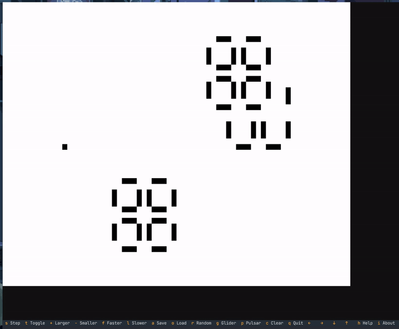

# textual-game-of-life

An implementation of [Conway's Game of Life](https://en.wikipedia.org/wiki/Conway%27s_Game_of_Life) (cellular automata) in the terminal using textual.



## installation

```console
pip install textual-game-of-life
```

## usage

```console
textual-game-of-life
```

## development
There is a Makefile for development tasks. You can use it to create a virtual environment, run tests, and build the package.

```console
Textual Game of Life
====================
build                Build the package (sdist and wheel)
create_venv          Create a virtual environment
help                 Show this help message
pypi-manual          Build, Tag and Upload the package to PyPI (requires PyPI token)
pypi                 Tag and trigger GitHub Actions to publish to PyPI
random               Run the game with random initial state
run-custom           Run with custom parameters (make run-custom W=30 H=30 S=0.3 B=2)
run                  Run the game with default settings
setup                Create and activate the virtual environment
tag-version          Tag the current branch with the version from pyproject.toml
test-cov             Run tests with coverage report
test-verbose         Run tests with verbose output
test                 Run tests with pytest
```
